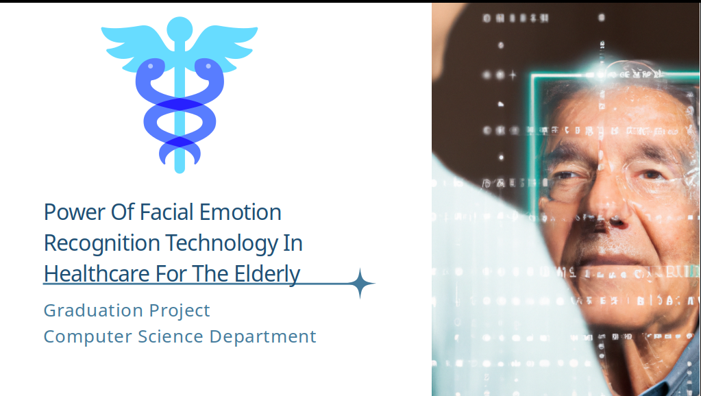
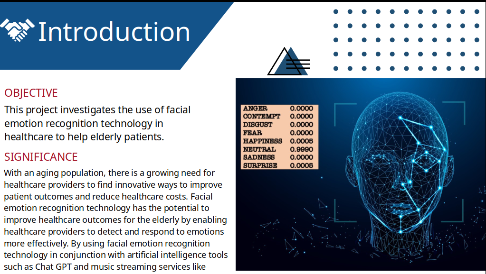
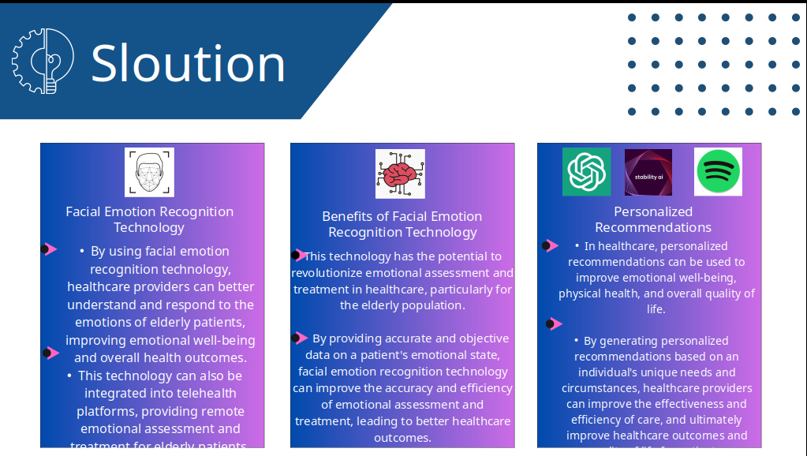
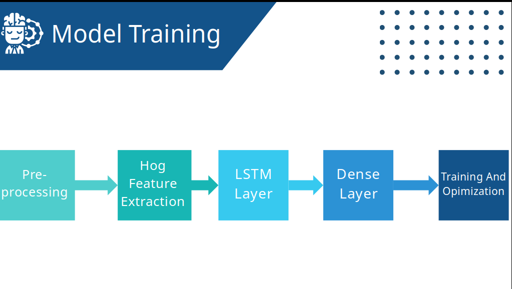
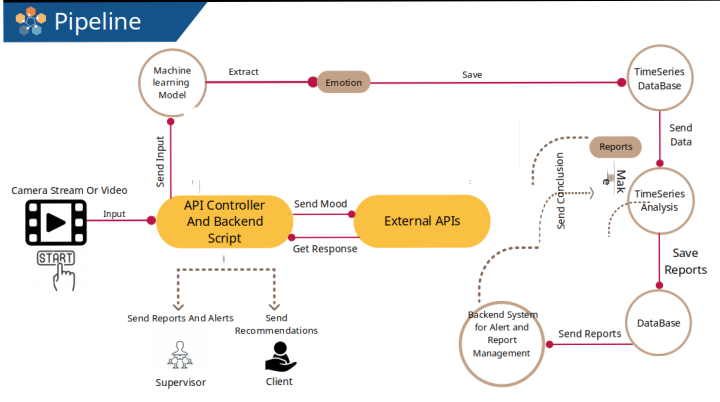
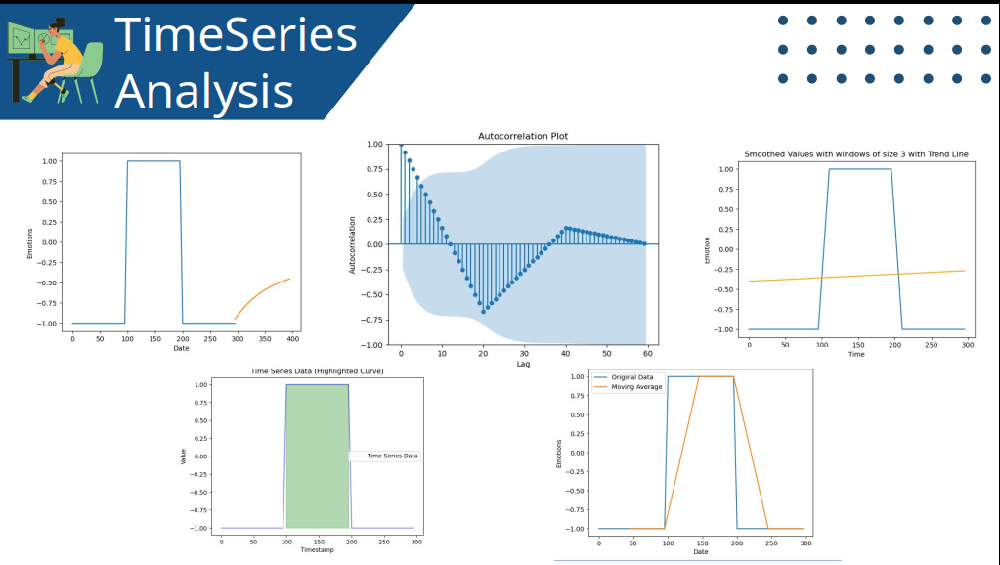
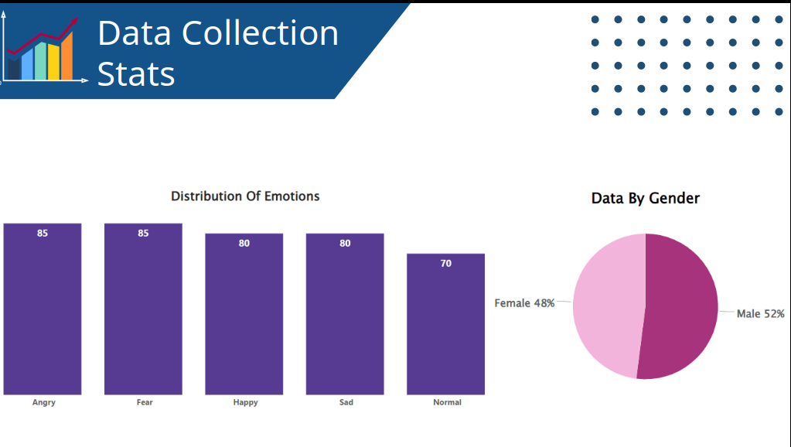
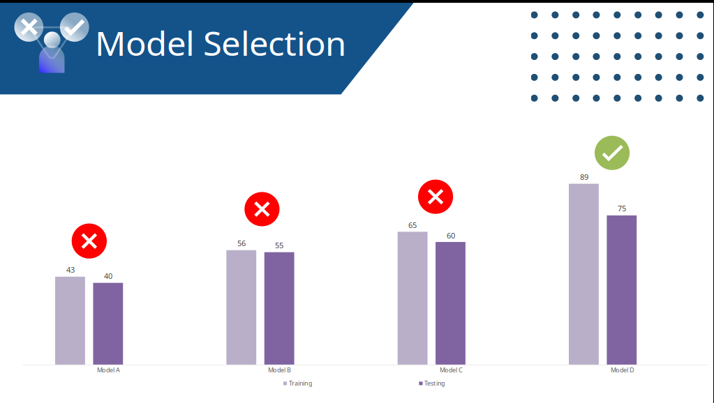
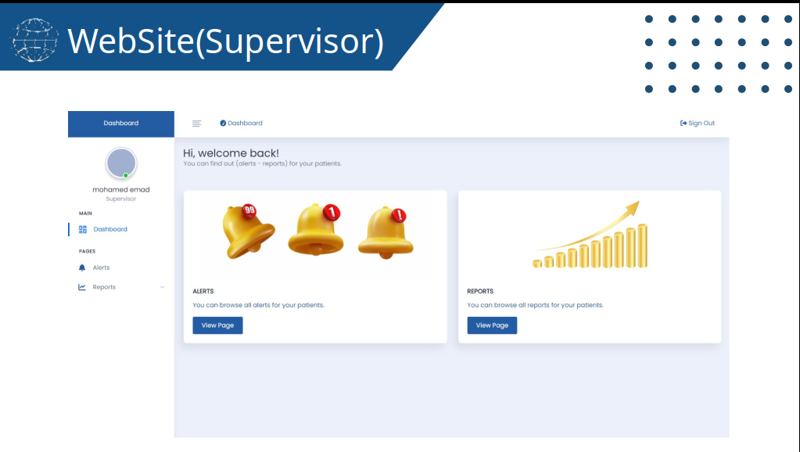

# Intro
An AI-driven facial emotion recognition system specifically designed for elderly healthcare environments.
This innovative solution leverages advanced computer vision and deep learning techniques to detect and classify facial emotions in real-time, empowering healthcare professionals to monitor the emotional well-being of elderly patients and enable timely interventions.

-----------------------------------------

# Features

Real-time Emotion Detection: Advanced facial recognition using HOG and CascadeClassifier
Deep Learning Integration: LSTM networks for accurate emotion classification
Healthcare-Focused: Tailored specifically for elderly patient monitoring
Data Analytics: Comprehensive statistical analysis and visualization of emotional patterns
API-Ready: RESTful API built with Flask for seamless integration
Persistent Storage: MongoDB integration for  emotion logging

# dataSet

# Technology 
Python, Flask, MongoDB, Microsoft Azure(vps)
,OpenCV CascadeClassifier, HOG (Histogram of Oriented Gradients), LSTM (Long Short-Term Memory),NumPy, Pandas, Matplotlib, Statistics

